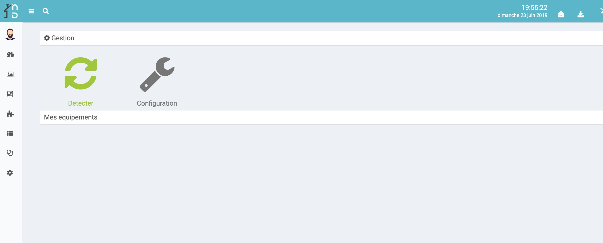
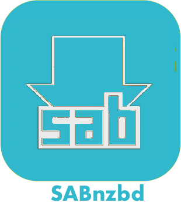

Présentation
===
Plugin de control des adoucisseur d'eau Sabnzbd pour la solution domotique NextDom/Jeedom

Configuration du plugin
===
Après téléchargement du plugin, il vous suffit d'activer celui-ci, puis de le configurer en fournissant vos credentiels wifi.sabnzbd.com

## Configuration des équipements

La configuration des équipements Sabnzbd est accessible à partir du menu plugin->Objet connectés. 
Pour ajouter un équipement, synchronisez avec votre compte Sabnzbd : cliquer sur  [Détecter] 

Vous retrouvez ici toute la configuration de votre équipement :

* Nom de l'équipement : nom de votre adoucisseur
* DSN  : "Device Serial Number" : l'ID unique de votre équipement
* Model  : Model d'adoucisseur
* Objet parent : indique l'objet parent auquel appartient l'équipement,
* Catégorie : les catégories de l'équipement (il peut appartenir à plusieurs catégories).
* Activer : permet de rendre votre équipement actif,
* Visible : rend votre équipement visible sur le dashboard,

View
===
Votre adoucisseur :

* Ce Jour : Consommation d’eau adoucie d’eau aujourd’hui
* Eau Disponible : Eau restante avant régénération.
* Moyenne : Consommation journalière moyenne
* Niveau Sel : Niveau Sel restant
* Recharger Sel : Nombre de jour restant 
* Connection : État de la connections internet (Adoucisseur <-> internet)
          * « Régénérer maintenant » : lancer une régénération immédiate.

## Commandes 

* Commande : 
          * « Programmer une régénération » :  programmer une régénération au prochain cycle (horaires définis sur wifi.sabnzbd.com)

Bug
===
En cas de bug avéré du plugin il est possible d'ouvrir une issue :

[https://github.com/NextDom/plugin-EcoWater/issues](https://github.com/NextDom/plugin-EcoWater/issues)
