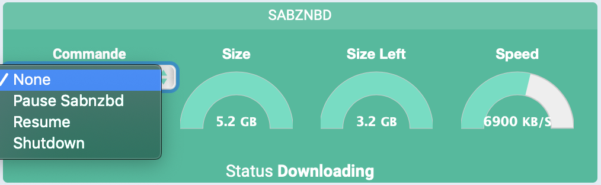

 Présentation
===
Plugin de control des serveurs SABnzbd

Configuration des équipements
===
Après téléchargement du plugin, il vous suffit d'activer celui-ci, puis de le configurer en fournissant host/port et clee API

* SABznbd Server Name : nom de votre server SABznbd
* Objet parent : indique l'objet parent auquel appartient le serveur.
* Catégorie : les catégories de l'équipement (il peut appartenir à plusieurs catégories).
* Activer : permet de rendre votre équipement actif,
* Visible : rend votre équipement visible sur le dashboard,
* SABnzbd Server Host IP : IP adresse de votre serveur
* SABnzbd Server Host IP : port de votre serveur
* SABnzbd API Key : cle API

View
===
Votre server :

* speed : ...
* status :...
* Commande : ...

## Commandes 

* Commande : 
          * « Pause » : ...
          * « Resume » : ...
          * « Shutdown » : ...

Bug
===
En cas de bug avéré du plugin il est possible d'ouvrir une issue :

[https://github.com/NextDom/plugin-SABnzbd/issues](https://github.com/NextDom/plugin-SABnzbd/issues)
